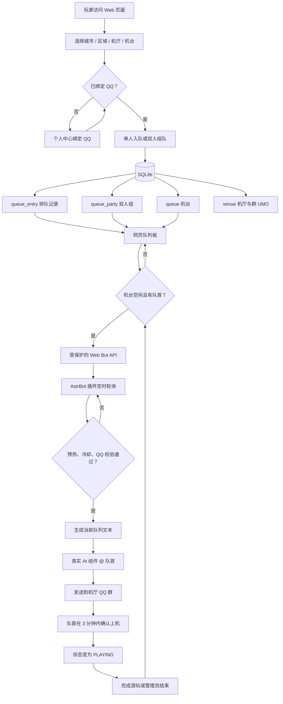

# 运行流程与自托管部署

本文面向将 VirtualWait 部署到自己服务器的运营者。部署前请先阅读[安全与发布清单](SECURITY.md)：该项目会处理登录、QQ 绑定和排队数据，生产环境必须使用已获得授权的身份验证服务。

> 当前持久层为 SQLite，适合单机、单实例部署。不要把同一个 `VIRTUALWAIT_DATA_DIR` 放到多台 Web 实例上共享，也不要在未迁移到服务型数据库前做负载均衡。

## 1. 系统如何运作



叫号消息的机厅名称来自 `venue`，等待名单来自当前被叫号机台的 `queue_entry`。项目的排队顺序按**机台独立**维护，因此不会将其他机台或其他机厅的用户混入当前通知。

```text
示例市示例区示例中心店队伍情况：

1、玩家 A
2、玩家 B、玩家 C

@玩家 A，请在3分钟内上机游玩
```

最后一行的 @ 由 AstrBot 的 `At` 消息组件发送，在 QQ 中是可点击的 mention，不是普通文本。

## 2. 部署前准备

### 服务器与网络

- 一台 Linux 服务器（systemd、Nginx）；建议使用受支持的长期维护发行版；
- Node.js `22.5+`、npm、Python `3.11+`、Git、Nginx、OpenSSL；
- 一个可访问的域名、内网地址或服务器 IP；HTTPS 证书为可选项；
- 仅开放 Nginx 使用的 `80` 端口；配置 HTTPS 时再开放 `443`。Web `3000` 和 Gateway `8787` 只监听本机；
- 运行账户（下文使用 `virtualwait`）、仓库目录 `/opt/virtualwait`、运行数据目录 `/var/lib/virtualwait`、备份目录 `/var/backups/virtualwait`。

### 业务与第三方资料

- 已替换示例城市、区县、机厅、机台和文案，详见[模板定制](TEMPLATE.md)；
- 已获得授权的身份验证 provider。生产 Gateway 不能使用 `mock`；可使用自有 `http` provider 或已获授权的 `sdgb_preview`；
- 管理员令牌和上线后的管理员操作流程；
- 若启用 QQ 叫号：已可用的 AstrBot 实例、可发送群消息的 QQ 机器人、每个机厅对应的群 UMO；
- 备份存储位置、数据保留期限、恢复演练和故障告警方案。

### 必须生成并妥善保存的值

所有值都应由密钥管理系统或权限为 `0600` 的环境文件提供；每个环境独立、长度至少 32 个随机字符，不能提交到仓库。

| 配置 | 放置位置 | 要求 |
|---|---|---|
| `SESSION_SECRET` | Web | Web 会话密钥 |
| `ADMIN_API_TOKEN` | Web | 管理台登录令牌 |
| `BOT_API_TOKEN` | Web + AstrBot | 可选；两端必须一致 |
| `PUBLIC_ID_HMAC_SECRET` | Web + Gateway | 两端必须完全一致 |
| `GATEWAY_SHARED_SECRET` / `VW_GATEWAY_SHARED_SECRET` | Web + Gateway | 两端必须完全一致 |
| `GATEWAY_KEY_ID` / `VW_GATEWAY_KEY_ID` | Web + Gateway | 两端必须完全一致 |
| provider 凭据 | Gateway | 仅限已授权的服务 |

可用 `openssl rand -hex 32` 生成随机值；生成后不要把结果粘贴到工单、截图、聊天记录或 Git 提交中。

## 3. 推荐部署步骤

以下命令以 Debian/Ubuntu 风格路径为例。请将 `YOUR_GIT_URL`、域名、Node/npm 路径和 TLS 配置替换为自己的值；不要直接复制示例中的 `CHANGE_ME_*` 值。

### 3.1 创建运行账户、目录和代码副本

```bash
sudo useradd --system --create-home --shell /usr/sbin/nologin virtualwait
sudo install -d -o virtualwait -g virtualwait -m 0750 \
  /var/lib/virtualwait/web \
  /var/lib/virtualwait/gateway \
  /var/backups/virtualwait

sudo git clone YOUR_GIT_URL /opt/virtualwait
sudo chown -R virtualwait:virtualwait /opt/virtualwait
```

安装 Web 和 Gateway 依赖并构建。Gateway 推荐使用专用虚拟环境：

```bash
sudo -u virtualwait bash -lc '
  cd /opt/virtualwait/apps/web && npm ci
  python3 -m venv /opt/virtualwait/.venv
  /opt/virtualwait/.venv/bin/pip install /opt/virtualwait/services/sdgb-gateway
'
```

### 3.2 配置生产环境文件

仓库提供可审查的样例，而不是可直接上线的密钥：

- [Web 生产样例](../infra/server/env/web.production.env.example)
- [Gateway 生产样例](../infra/server/env/gateway.production.env.example)

复制到服务器受控目录，并设置为仅 root 可读。systemd 会在启动服务时读取它们并注入给 `virtualwait` 进程。

```bash
sudo install -d -o root -g root -m 0700 /etc/virtualwait
sudo install -o root -g root -m 0600 \
  /opt/virtualwait/infra/server/env/web.production.env.example \
  /etc/virtualwait/web.env
sudo install -o root -g root -m 0600 \
  /opt/virtualwait/infra/server/env/gateway.production.env.example \
  /etc/virtualwait/gateway.env
sudoedit /etc/virtualwait/web.env
sudoedit /etc/virtualwait/gateway.env
```

至少完成以下替换和核对：

1. `APP_BASE_URL=http://你的域名` 或 `https://你的域名`，必须与用户实际访问的地址一致；
2. Web 数据目录为 `/var/lib/virtualwait/web`，Gateway 数据库为 `/var/lib/virtualwait/gateway/gateway.db`，备份目录为 `/var/backups/virtualwait`；
3. 表格中标出的两端共享值严格一致，其他密钥全部独立；
4. Web 保持 `GATEWAY_MODE=remote`、`GATEWAY_BASE_URL=http://127.0.0.1:8787`；
5. Gateway 保持 `VW_GATEWAY_HOST=127.0.0.1`，并配置已授权的 `http` provider 或 `sdgb_preview`；
6. Nginx 确实会清洗并重写转发 IP 头后，才将 `TRUST_PROXY_HEADERS=true`；
7. 需要 QQ 通知时设置非空的 `BOT_API_TOKEN`；否则留空即可关闭 Bot API。

使用临时 systemd scope 构建，使 systemd 在不放宽 `0600` 环境文件权限的前提下，将环境注入给 `virtualwait` 用户进程。若本机 npm 不在 `/usr/bin/npm`，请替换为实际路径：

```bash
sudo systemd-run --wait --collect --uid=virtualwait --gid=virtualwait \
  --property=EnvironmentFile=/etc/virtualwait/web.env \
  --working-directory=/opt/virtualwait/apps/web \
  /usr/bin/npm run preflight -- --production
sudo systemd-run --wait --collect --uid=virtualwait --gid=virtualwait \
  --property=EnvironmentFile=/etc/virtualwait/web.env \
  --working-directory=/opt/virtualwait/apps/web \
  /usr/bin/npm run build
```

### 3.3 安装 systemd 服务

复制仓库的服务模板。它们已限制可写目录和运行权限，但仍需确认路径与本机一致。

```bash
sudo cp /opt/virtualwait/infra/server/systemd/virtualwait-*.service /etc/systemd/system/
sudo cp /opt/virtualwait/infra/server/systemd/virtualwait-*.timer /etc/systemd/system/
```

因为上一步使用了 Python 虚拟环境，请编辑 `virtualwait-gateway.service`，将：

```ini
ExecStart=/usr/bin/python3 -m virtualwait_gateway
```

改为：

```ini
ExecStart=/opt/virtualwait/.venv/bin/python -m virtualwait_gateway
```

同时确认所有 unit 中的 `User`、`Group`、`WorkingDirectory`、`EnvironmentFile`、`ReadWritePaths` 与实际路径一致。验证、启用并启动服务：

```bash
sudo systemd-analyze verify /etc/systemd/system/virtualwait-*.service /etc/systemd/system/virtualwait-*.timer
sudo systemctl daemon-reload
sudo systemctl enable --now \
  virtualwait-gateway.service \
  virtualwait-web.service \
  virtualwait-maintenance.service \
  virtualwait-backup.timer \
  virtualwait-healthcheck.timer

sudo systemctl start virtualwait-backup.service
sudo systemctl status virtualwait-web virtualwait-gateway virtualwait-maintenance
```

`maintenance` 是常驻服务；备份和健康检查由 timer 触发。查看运行日志可使用：

```bash
sudo journalctl -u virtualwait-web -u virtualwait-gateway -f
```

### 3.4 配置 Nginx（HTTPS 可选）

以仓库的 [Nginx 模板](../infra/server/nginx/virtualwait.conf) 为基础，替换 `wait.example.com` 为自己的域名。模板将 Web 流量代理到 `127.0.0.1:3000`，并覆盖客户端提交的转发 IP 头。

```bash
sudo cp /opt/virtualwait/infra/server/nginx/virtualwait.conf /etc/nginx/sites-available/virtualwait
sudoedit /etc/nginx/sites-available/virtualwait
sudo ln -s /etc/nginx/sites-available/virtualwait /etc/nginx/sites-enabled/virtualwait
sudo nginx -t
sudo systemctl reload nginx
```

仓库模板本身就是可直接使用的 HTTP 反向代理配置：将 `APP_BASE_URL` 设为 `http://你的域名`（或内网 IP）即可，不需要证书。

HTTPS 是可选增强：若日后需要启用，可在 Nginx 或受控上游代理配置证书、开放 `443`，并把 `APP_BASE_URL` 改为对应的 `https://` 地址。使用 HTTP 时，生产 Cookie 不会标记为 `Secure`，因此应只用于受控内网、可信 Wi-Fi 或你能接受明文传输风险的场景；无论 HTTP 还是 HTTPS，都不要把 Gateway 的 `8787` 端口暴露到公网。

## 4. 启用 AstrBot QQ 叫号（可选）

1. 在 `web.env` 填入 `BOT_API_TOKEN` 并重启 Web：`sudo systemctl restart virtualwait-web`。
2. 用 `ADMIN_API_TOKEN` 登录 `/admin`，在每个需要通知的机厅填写群 `groupUmo`。
3. 将 `plugins/astrbot_plugin_virtualwait_queue/` 安装到 AstrBot 插件目录，并在 AstrBot 运行环境执行 `pip install -r requirements.txt`。
4. 在 AstrBot 插件配置中填写：

```text
base_url=与 APP_BASE_URL 相同的 http:// 或 https:// 地址
bot_token=与 Web 的 BOT_API_TOKEN 完全一致
reminder_minutes=3
```

`groupUmo` 优先于插件 `routing` 和 `default_umo`。插件的完整配置、冷却、预热与排错说明见[队列通知联动](QUEUE_NOTIFY.md)。

## 5. 上线验收与日常维护

首次上线至少确认：

- [ ] `APP_BASE_URL` 对应的 HTTP 或 HTTPS 地址可访问，`/api/healthz` 不会经公网反向代理暴露；
- [ ] 可完成一次已授权的登录、入队、取消、确认上机和结束游玩；
- [ ] 管理台能修改机厅群 UMO、机台状态和超时设置；
- [ ] QQ 通知显示当前等待名单，且队首为可点击的真实 @；
- [ ] `systemctl list-timers 'virtualwait-*'` 可看到备份和健康检查 timer；
- [ ] 已验证一份 SQLite 备份可以恢复到隔离目录；
- [ ] 升级前先备份，并在 staging 环境执行测试和构建。

发布前可在代码目录运行：

```bash
node infra/server/scripts/verify-server-env-examples.mjs
node infra/server/scripts/verify-nginx-template.mjs
cd apps/web && npm run preflight -- --production
```

完整验证入口、数据保留和安全要求分别见根目录 [README](../README.md)、[安全与发布清单](SECURITY.md) 和[自托管模板说明](../infra/server/README.md)。
